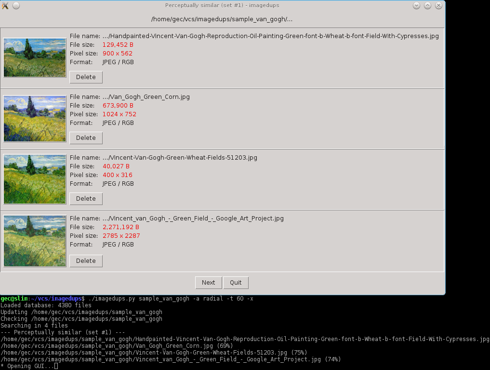

Deduplicate Images
==================

Tool to find duplicate or similar images. Identifies bit-wise duplicates
first, using SHA256 hash function. Then, compares the visual content
of the remaining images using perceptual hashes. These can recognise
for example: different scans of same original image, recompressed
or edited images.

The perceptual hash algorithms come from
[pHash library](http://phash.org/docs/design.html). Default algorithm
is *MH*, which is pretty accurate, other options are *DCT* and *Radial*,
both faster and reasonably accurate.

Usage
-----

Hash `~/Pictures` directory, recursively traversing into subdirectories (`-r`),
using fast compare to detect modified files (`-F`) and present each group
of similar images in GUI window (`-x`):

    dedup-images.py -r ~/Pictures -F -x

Other options are documented in program help:

    dedup-images.py --help

GUI
---

The program contains simple GUI to show identified groups of similar images.
Use `-x` option to switch on the GUI.

The GUI requires just few common Python modules:

* tkinter (python3-tk)
* PIL + ImageTk (python3-pil, python3-pil.imagetk)

I also suggest to change the image viewer to your favorite light-weight
alternative. I use `feh`. The default is `xdg-open`, which should open
some viewer program on any system, but it's usually full-blown photo viewer,
which is not good for this use case (one-time image viewing).

Edit the config file at `~/.config/dedup-images.conf` to change the viewer.

Installation
------------

Build:

    ./setup.py build

Build requires:

* python3-dev
* cython3
* libphash-dev

Install:

    sudo ./setup.py install

Inplace build (to run without installation):

    ./setup.py build_ext --inplace

pHash Build
-----------

Download source from [phash.org](http://phash.org/download/).

Build requires:

* cimg-dev

Build:

    ./configure --disable-video-hash --disable-audio-hash --enable-pthread --enable-openmp
    make
    sudo make install
    sudo ldconfig

Programming Documentation
-------------------------

Build:

    cd doc
    make html

Build requires:

    python3-sphinx

Read in default browser:

    make read
